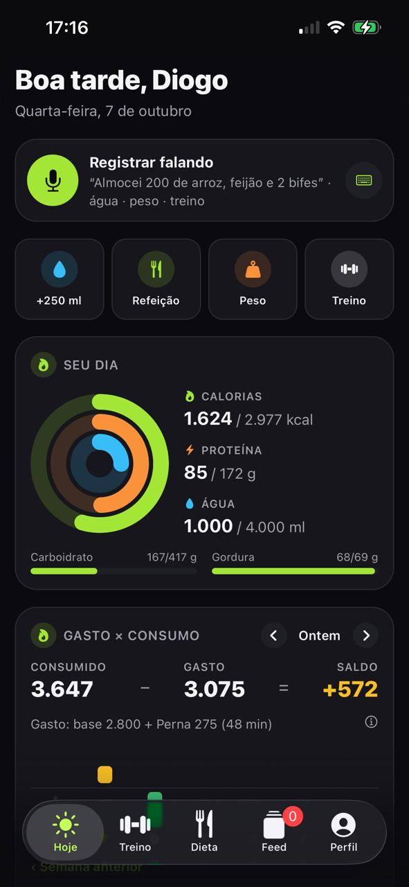
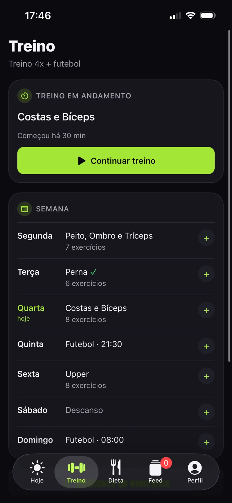
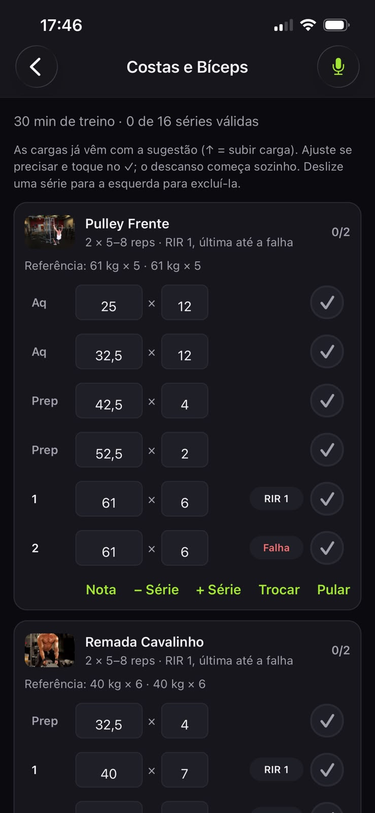
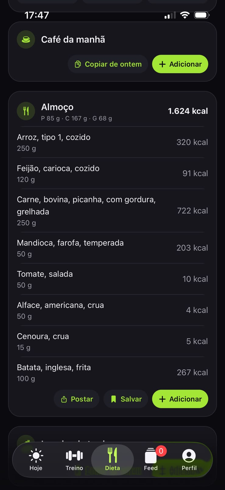
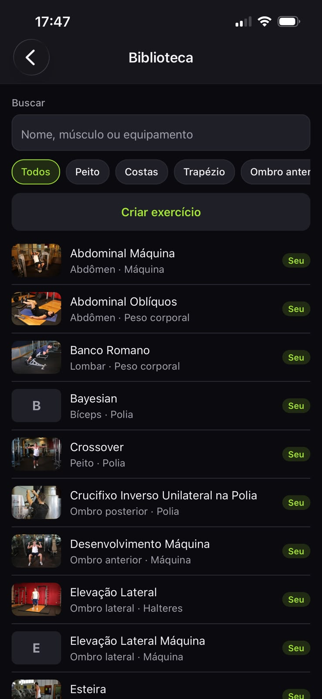

# FitVibe

[](https://github.com/diogoduo/FitVibe/actions/workflows/ci.yml)

App de treino e dieta **offline-first**, com sincronização e um lado social. React Native, Expo e
Supabase. Feito por [**Diogo Duo**](https://www.linkedin.com/in/duodiogo/).

Tudo é gravado primeiro no celular, então funciona no subsolo da academia sem sinal, e sincroniza
com o servidor quando a conexão volta.

<p align="center">
  
  
  
  
  
</p>

## O que ele faz

- **Treino**: plano semanal, registro de cada série (carga, reps, RIR) com aquecimento automático,
  progressão de carga série por série, e1RM, recordes com comemoração e timer de descanso com
  notificação.
- **Dieta**: tabela TACO embutida, leitor de código de barras (Open Food Facts), diário por
  refeição, porções, água e meta de calorias que se ajusta pelo gasto real.
- **Assistente por voz**: "almocei 200 de arroz, 100 de feijão e 2 bifes" vira registros para
  conferir; também água, peso, medidas e séries do treino.
- **Gasto × consumo**: o gasto do dia (base + treinos e futebol), o déficit ou superávit e a
  semana em barras; no domingo, o resumo da semana para postar.
- **Futebol**: cronômetro, partidas ganhas/empatadas/perdidas, gols, assistências e uma nota.
- **Progresso**: peso com tendência, força por exercício, volume semanal por músculo, adesão à
  dieta, medidas e fotos de antes e depois.
- **Social**: perfil com @usuário (privado por padrão), seguir com aprovação, feed com posts de
  refeição, treino e do dia, curtidas, comentários, bloqueio e notificações dentro do app.
- Lembretes de água e refeições, exportação em CSV e PDF, tema claro e escuro e um tutorial.

## Destaques técnicos

- **Offline-first** com SQLite + Drizzle: o celular é a fonte da verdade, e uma fila de envio é
  alimentada por gatilhos SQLite gerados do próprio esquema.
- **Sincronização**: a última alteração vence (o servidor recusa versões mais antigas) e o
  download é incremental por cursor (carimbo do servidor + id), em páginas.
- **Segurança no banco**: RLS em todas as tabelas; as regras do social (quem vê o quê, seguir com
  aprovação, bloqueio, notificações) são funções e gatilhos no Postgres, não código do app.
- **Treino**: progressão dupla série por série, e1RM por Epley contando as reps na reserva,
  recordes e meta calórica adaptativa pelo gasto real (consumo − variação da tendência do peso).
- **Assistente por voz** com Gemini: a IA escolhe o **código** do alimento num catálogo enviado
  em linhas curtas e as calorias saem do banco do app, sem inventar números. As instruções e o
  limite diário por pessoa ficam numa Edge Function do Supabase.
- **Testes**: mais de 230 no Jest (contas puras e gravações num SQLite em memória com as mesmas
  migrações do app) e testes de integração contra um Supabase de verdade.

## Stack

React Native 0.86 · Expo SDK 57 (Expo Router, expo-sqlite, expo-camera, expo-audio,
expo-notifications) · TypeScript estrito · NativeWind 4 · Drizzle ORM · Supabase (Auth, Postgres,
Storage, Realtime, Edge Functions) · React Query · Reanimated 4 · react-native-svg · Jest

## Estrutura

```
fitvibe/
├── src/
│   ├── app/                  # telas (Expo Router: cada arquivo é uma rota; (tabs)/ = as 5 abas)
│   ├── components/ui/        # base visual: Card, Button, Icon, PressableScale, SwipeRow...
│   ├── components/charts/    # linha, barras e anéis (react-native-svg)
│   ├── db/                   # SQLite: schema.ts, client.ts, migrations/ (geradas)
│   ├── features/             # uma pasta por funcionalidade (contas, consultas, gravações, cards)
│   │   ├── workout/ plan/ exercises/ media/      # treino, plano semanal, biblioteca
│   │   ├── foods/ diary/ goals/                  # TACO, diário, metas e meta adaptativa
│   │   ├── weight/ measurements/ progress/ progress-photos/
│   │   ├── social/ notifications/ account/       # perfil público, feed, conta
│   │   ├── assistant/                            # assistente por voz
│   │   ├── energy/ week/ activity/               # gasto calórico, resumo da semana, futebol
│   │   └── reminders/ export/ today/ tutorial/
│   ├── lib/                  # datas e números em pt-BR, haptics, Supabase
│   ├── sync/                 # motor de sincronização e conta
│   └── theme/                # paletas clara e escura e useColors()
├── supabase/
│   ├── migrations/           # esquema do servidor, RLS e regras do social
│   └── functions/assistente/ # Edge Function do assistente (Gemini)
├── site/                     # página de confirmação de e-mail (Site URL do Supabase)
├── scripts/                  # catálogo, TACO, SQL da sincronização, Supabase local, testes
└── docs/                     # funcionalidades fase a fase, deploy e prints
```

## Como rodar

> Quer testar no seu celular (iPhone ou Android) sem rodar nada? Me peça acesso pelo [LinkedIn](https://www.linkedin.com/in/duodiogo/):
> no iPhone o app abre pelo Expo Go para quem é convidado, e no Android é um APK
> ([como funciona](docs/deploy.md#3-publicar-para-o-expo-go-sem-o-pc-ligado)).

Pré-requisitos: Node.js 20 ou mais novo, Docker Desktop (Supabase local) e o app **Expo Go** no
celular, na mesma Wi-Fi do PC. Desde o SDK 57, o Expo Go no iPhone só abre projetos em
desenvolvimento se ele e o Expo CLI estiverem logados na mesma conta Expo.

```bash
npm install
cp .env.example .env.local   # preencha EXPO_PUBLIC_SUPABASE_KEY (npm run db:status mostra)
npm run db:start             # Supabase local no Docker
npm run db:migrate           # tabelas, RLS e funções no Supabase local
npx expo login               # uma vez: mesma conta do Expo Go
npm start                    # Metro + QR code
```

Os comandos `db:*` controlam os contêineres pelo Docker, sem precisar da CLI do Supabase. O
Supabase Studio fica em http://127.0.0.1:54323.

| Comando                              | O que faz                                                                   |
| ------------------------------------ | --------------------------------------------------------------------------- |
| `npm test`                           | testes do Jest                                                              |
| `npm run typecheck` / `npm run lint` | TypeScript e ESLint                                                         |
| `npm run test:sync`                  | integração contra o Supabase local (cria contas temporárias e apaga no fim) |
| `npm run test:assistente`            | o assistente contra o Gemini de verdade (precisa da função na nuvem)        |
| `npm run db:generate`                | migração do SQLite depois de mudar `src/db/schema.ts`                       |
| `npm run db:sync-sql`                | regera o SQL do servidor e os gatilhos da fila a partir do esquema          |
| `npm run publicar`                   | publica a versão atual no EAS Update (ver [docs/deploy.md](docs/deploy.md)) |

Mais detalhes: [funcionalidades fase a fase](docs/funcionalidades.md) e
[deploy (Supabase na nuvem, assistente, publicação)](docs/deploy.md).

## Privacidade

- **Coletado**: perfil (nome, nascimento, altura, sexo, objetivo), peso, medidas, diário
  alimentar, água e treinos. Com conta, também e-mail, foto, @usuário, posts e comentários.
- **Onde fica**: no celular (SQLite). Com conta, uma cópia no Supabase, protegida por RLS (cada
  conta só lê o que é seu; o perfil público mostra só o que a pessoa escolheu). Fotos de progresso
  ficam só no celular.
- **Assistente por voz**: a fala (ou o texto) e o catálogo de alimentos vão para o Gemini, do
  Google; no plano grátis o Google pode usar o que for enviado para melhorar os produtos dele. O app
  avisa antes do primeiro uso, e o áudio é apagado do celular logo depois do envio.
- **Excluir**: Ajustes → Conta → **Excluir conta** apaga a conta e tudo dela no servidor,
  inclusive as fotos; "Apagar todos os dados" limpa o celular.

## Créditos e dados

- **TACO** — Tabela Brasileira de Composição de Alimentos, 4ª edição (NEPA/UNICAMP, 2011), a partir
  do CSV do projeto [brolesi/taco](https://github.com/brolesi/taco).
- **Fotos dos exercícios** — [free-exercise-db](https://github.com/yuhonas/free-exercise-db)
  (domínio público, Unlicense), reduzidas para WebP.
- **Produtos por código de barras** — [Open Food Facts](https://openfoodfacts.org) (licença ODbL).

## Licença

Código sob a [licença MIT](LICENSE). Os dados de terceiros acima mantêm as licenças deles.
